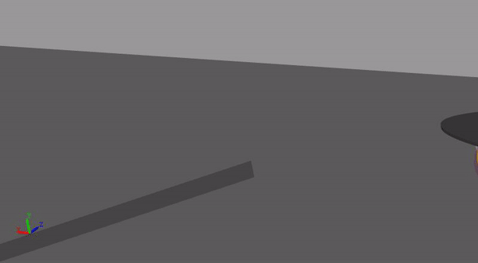

# Digital Twin for a Mobile Articulated Gripper Robot SL2023
This is the repository for the Software Lab project in 2023.
\
# Description
The project Digital Twin for a Mobile Articulated Gripper Robot simulates the functionalities of a mobile robot equipped with a robotic arm gripper in a construction scenario, using the software [Simscape&trade;] [Multibody&trade;] from [MathWorks&reg;].
In this case it efficiently retrieves bricks from Area A and promptly transport and position them in Area B for the purpose of constructing a wall.

# Mobile base
The design of the mobile base geometry does not entail any specific complexities, due to that it consists in a simple 3-wheel design with caster wheel. This configuration allows for the control over the two rear wheels, eliminating the need for a suspension system.
\
The model has been generated with SOLIDWORKS®, which has a functionality that exports the entire assembly to a Simulink Multibody model, serving as a template.

**Contact modelling**\
Regarding contact modelling, the Spatial Contact Force Block from Simscape Multibody has been used for its simulation. Contact is an essential part of the mobile base performance, not just due to basic functionality, but also tests the stability of the geometry, as in the first draft the platform was supposed to be driven over a road with obstacles. However, challenges like undetected contact, simulation crashes due to numerical singularities, or neglecting concave obstacles by the algorithm arose.
\
\
\
\
These issues were resolved by enforcing pointwise contact, using a cloud of points to represent obstacles on a clear road. However, this solution still had a high computational effort, and the road remained clear in the final version.

**Motion & power control**\
To execute the path following task the Pure Pursuit Block has been used. It calculates the required translational and angular velocities for the base to reach a point, using the monitored lookahead distance to the user-defined waypoints. The output of this block is then used to determine the required angular velocity for each wheel. However, the algorithm lacks the ability to stabilize the robot upon reaching its goal. Consequently, extra control over the wheels' velocity was implemented for this purpose.
By assessing the error between the monitored and required velocities and utilizing a proportional controller, the torque for the wheels is calculated. Each rear wheel is driven by an electric circuit, incorporating Battery and Motor & Drive blocks. This last component transforms the required torque value into a mechanical rotation signal that the wheel subsequently receives as motion input.

# Robotic Arm and Gripper

**Motion Control**\
The control approach chosen for the arm and gripper is motion control, which means joint angle and its derivatives are given to the joints to drive them. This control method is more robust, more precise and needs less computation effort compared to torque control because motion control drives joints to the exact angle needed and the error is mostly given by the inverse kinematics solver chosen. But on the other hand, this method is less representative of the real-world robot because the real arm is driven by torque provided by the motor. Although this method is less representative, it is still possible to control the real-world robotic arm by using it. All we must do is computing the torque needed for controlling each joint. 

\

**Control algorithm**\
Once the mobile platform reaches the brick storage area or construction area, the control algorithm of the arm is called. Initially, the laying position is given, and the picking position of bricks is acquired by the camera on Kinova Gen3, which is mimicked by a transform sensor block in the model. Next, according to this position, paths are planned by setting waypoints. Then, an inverse kinematics solver in MATLAB®. is utilized to compute joint angles at each waypoint. Finally, the trajectories are prescribed by the trapezoidal velocity generator.

# Task scheduler

The Task Scheduler function completed the need for task management. When navigation
is required, it efficiently idles the robotic arm module while activating the mobile base.
Conversely, for pick-and-place operations, it does the opposite.

\

# Software prerequisites
- MATLAB R2023b or higher
- Simulink version 23.2 or compatible
- Simscape version 23.2 or compatible
- Simscape Multibody version 23.2 or compatible
- Simscape Electrical version 23.2 or compatible
- Navigation Toolbox version 23.2 or compatible
- Robotics System Toolbox version 23.2 or compatible 

# Execution instructions
To run the executables:
 1. Navigate to **``Digital-Twin-for-Mobile-Articulated-Gripper-Robot-SL2023\Three_wheeled
 _base``**
 2. Run **``Three_wheeled_base_LOAD _DATA.m``**
 3. Run **``sm_kinovaGen3 _arm.slx``**

# Authors
Please for further information, contact the authors:
- Chi-Chia Tung <claudrubher99@gmail.com>
- Claudia Rubio Hervás <ge85qel@mytum.de>
- Minas Apostolakis <minas.apostolakis@gmail.com>
